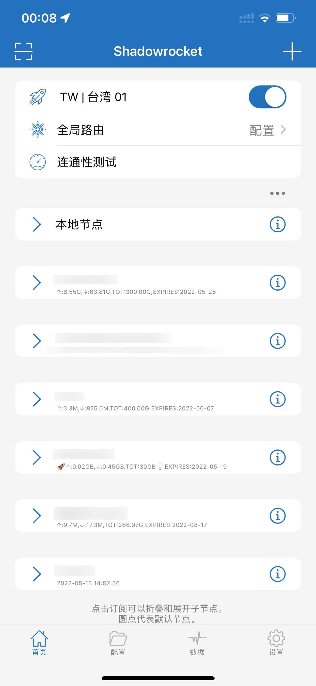

# 快速上手

现在，你已经在你的 iPhone、iPad 或者 Mac 上安装了 Shadowrocket ，那么接下来让我们，正式迈出第一步。

刚刚打开 Shadowrocket 或许会觉得有些迷茫，但不要紧张，你马上就可以学会基础用法。

### 添加代理服务器节点

添加服务器节点时，主要分为两种情况：

1. 使用订阅链接批量导入服务器节点
2. 单个节点导入


如果你购买了机场的代理服务，机场一般都会为你提供订阅链接。


#### 使用订阅链接导入（推荐）

让我们先介绍一下第一种情况——使用订阅链接批量导入服务器节点。

打开 Shadowrocket，点击首页右上角的加号➕，进入“添加节点”界面。

.PNG>)

接着，点击“类型”一栏，进入“类型”界面，确保你选择的是 Subscribe（订阅）类型，如果不是 Subscribe ，请手动选择。

.PNG>)

返回“添加节点”界面，在 URL 一栏中，填入你之前从机场复制的订阅链接。如果你不知道如何从机场复制订阅链接，请询问你的机场主（代理服务提供商）。
